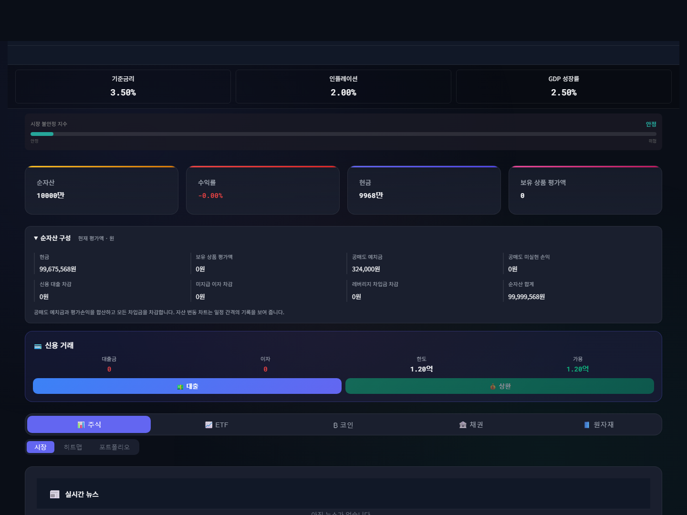
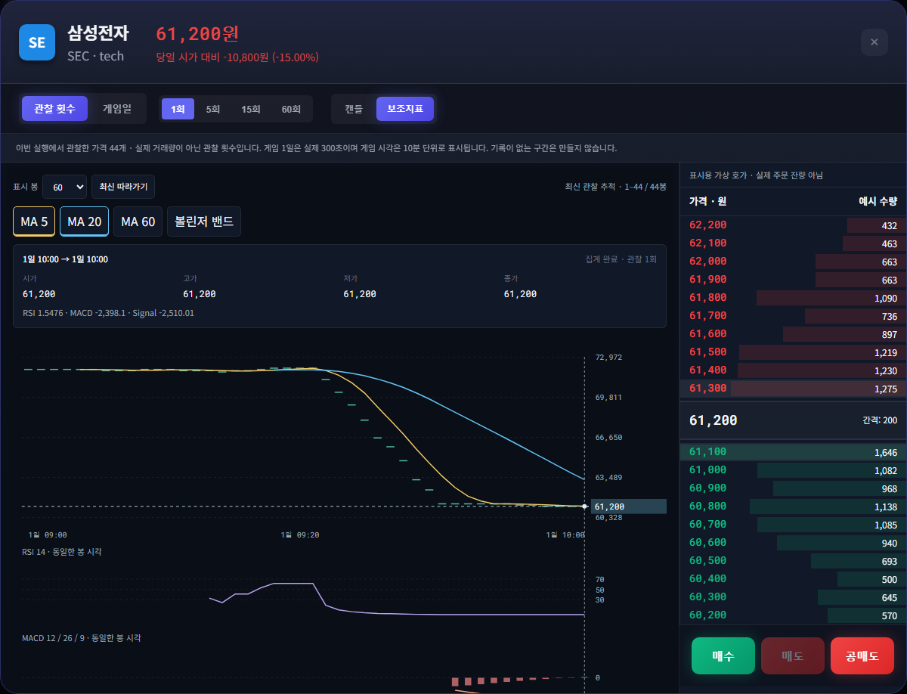
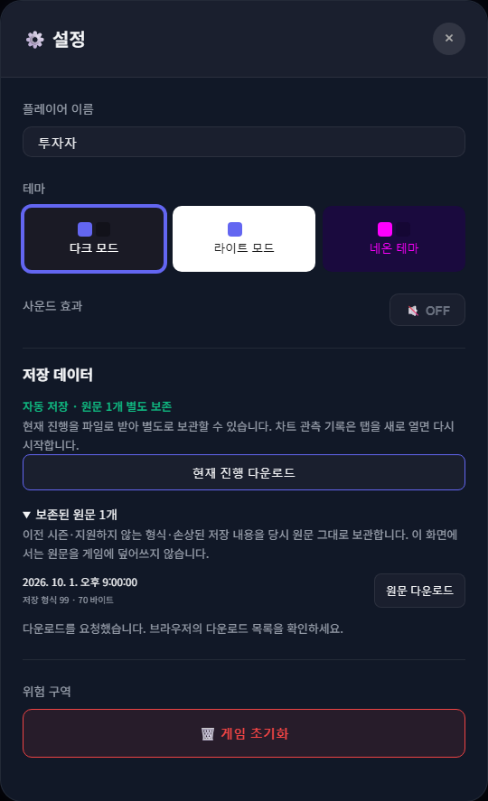
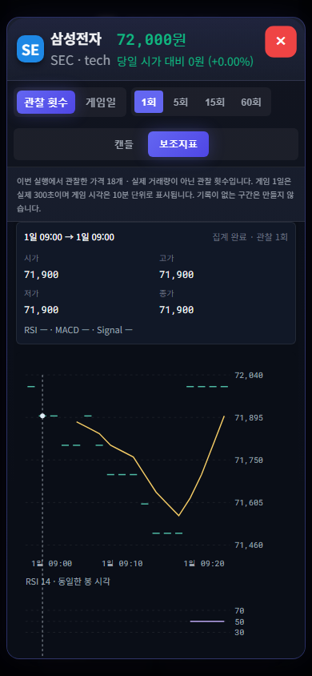

# 트레이딩 게임 · 디테일 개선판 1.15.0

React + Vite 기반의 가상 시장 시뮬레이션입니다. 주식·ETF·코인·채권·원자재의 가격, 주문, 공매도, 신용 거래를 브라우저에서 실험할 수 있습니다. 가격과 뉴스는 게임 안에서 생성되며 실시간 거래소 데이터가 아닙니다.

이 브랜치는 공개 배포 v1.14 이후 `main`에 병합된 변경을 유지한 **검토용 1.15.0 후보**입니다. 공개 릴리스, 설치본, Firebase 서비스는 이 PR로 자동 변경되지 않습니다.

## 이번 개선

- **설명 가능한 순자산**: 현금 + 보유 상품 평가액 + 공매도 예치 증거금 + 공매도 평가손익 − 신용 원금 − 이자 − 레버리지 차입금. 대시보드에서 원 단위 구성값을 펼쳐 확인합니다.
- **실제 관측 차트**: 앱이 관측한 가격만 보관하고 고정된 관찰 횟수 또는 게임일로 봉을 묶습니다. 과거 가격이나 거래량을 만들어 채우지 않습니다. 보조지표는 해당 봉의 시간축과 일치하며, 방향키로 봉의 시가·고가·저가·종가와 시각을 읽을 수 있습니다.
- **거래 기록 일치**: 공매도 청산·강제 정산의 손익과 일일 통계, 예약 주문의 부분 체결 및 레버리지 원금을 추적합니다. 자산 기록은 마지막 기록 시각을 표시하고 0원도 그대로 나타냅니다.
- **저장 원문 보호**: 이전 시즌·미지원 형식·손상된 저장 원문은 검증된 별도 보관함에 남깁니다. 보존 또는 자동 저장에 실패하면 화면에 알리고 현재 진행 다운로드를 제공합니다. 초기화는 이 게임의 진행만 지웁니다.
- **배포 및 접근성**: 모든 로컬 화면을 오프라인 캐시에 포함하고 이전 앱 캐시만 정리합니다. 모바일 스크롤·키보드 봉 선택·확대 조작을 지원합니다.

## 화면






## 사용법과 한계

- 상품을 눌러 차트를 열고 **관찰 횟수 / 게임일** 및 **캔들 / 보조지표**를 선택합니다. 봉 선택 후 좌우 방향키·Home·End로 이동합니다. Escape는 고정 선택을 풀고, 다시 누르면 차트를 닫습니다.
- 관측 기록은 상품마다 최근 4,096개이며 현재 탭 실행 동안만 유지됩니다. 새로고침·새 시즌은 기록을 새로 시작합니다. 게임 1일은 실제 300초이며 표시 시각은 10분 단위입니다.
- **순자산 구성**은 현재 평가입니다. 자산 차트는 약 10초 간격의 최근 기록으로, 거래 사이의 모든 순간이나 전체 시즌을 보존하지 않습니다. 손익 통계는 저장된 정산 기록 범위에서 계산합니다.
- 호가는 표시용 예시 수량입니다. 실제 주문 잔량, 거래량, 주문 대기열을 재현하지 않습니다. 각 표시 가격은 상품별·가격대별 게임 호가 단위에 맞춥니다.
- 설정 → **저장 데이터**에서 현재 진행 또는 보존된 원문을 내려받습니다. 현재 진행 내보내기는 저장 형식 v4입니다. 원문 다운로드는 변경 없이 보관하는 기능이며 게임에 복원하는 기능은 아닙니다.
- 기존 v4 이전 저장의 새 시즌 시작 정책을 유지합니다. v4 진행을 읽을 때 일일 거래 통계와 부채를 보존합니다. 브라우저 데이터 자체를 지우면 보관함도 사라지므로 필요한 원문은 파일로 보관하세요.
- 온라인 랭킹은 별도의 Firebase 구성이 필요합니다. 기본 배포본은 로컬 게임입니다. 기존 서버 재생 엔진은 공매도 현금흐름·수수료에서 로컬 게임과 차이가 있으며 **이번 로컬 회계 결과의 서버 검증을 보장하지 않습니다**. 서버 프로토콜과 배포는 변경하지 않았습니다.

구체적인 계산·기록 범위는 [재무 설명](docs/detail-finance.md), [차트 설명](docs/detail-charts.md), [저장 보호 설명](docs/detail-storage.md)에 있습니다.

## 실행

Node.js 24.19.0으로 검증합니다.

```sh
npm ci
npm run dev -- --host 127.0.0.1 --port 5260
```

배포 파일은 HTTP 서버에서 제공해야 합니다. `index.html`을 파일로 직접 여는 방식은 지원하지 않습니다.

```sh
npm run build
npm run preview -- --host 127.0.0.1 --port 5265
```

최초 온라인 실행에서 로컬 화면 파일을 저장하면 같은 주소에서 오프라인으로 다시 열 수 있습니다. 외부 웹 폰트가 없는 경우 시스템 글꼴을 사용합니다. 업데이트 대기 중인 경우 진행을 저장한 뒤 같은 사이트의 모든 탭을 닫고 다시 열면 새 캐시가 활성화됩니다.

## 검증

```sh
npm run lint
npm test -- --runInBand
npx playwright install chromium
npm run test:detail
npm run build
npm run test:offline
npx playwright test --project=chromium --project="Mobile Chrome" --workers=1
```

새 디테일 검증은 실제 단일 클릭·키보드·다운로드·새로고침을 사용합니다. 기록/차트 검증용 `window.stockLab`은 복사된 상태를 읽거나 현재 진행을 저장하는 API만 제공합니다. 시장 상태를 바꾸는 숨겨진 입력은 없습니다. 브라우저 검증은 GPU 자원 충돌을 피하도록 순차 실행합니다.

로컬 실행 ZIP의 제작과 실행 전제는 [웹 패키지 설명](docs/web-package.md)에 있습니다.

## 선택적 온라인 기능

1. `.env.example`을 복사해 실제 `VITE_FIREBASE_*` 값을 설정합니다.
2. `.firebaserc`의 프로젝트 식별자를 설정합니다.
3. 배포 전 로컬/서버 거래 규칙의 일치 여부부터 별도로 검증합니다. 기존 절차는 [Firebase 배포 문서](docs/FIREBASE_DEPLOYMENT.md)를 참고하세요.
